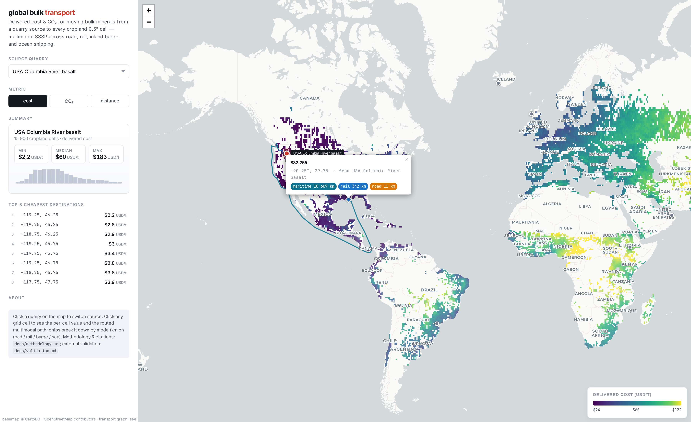
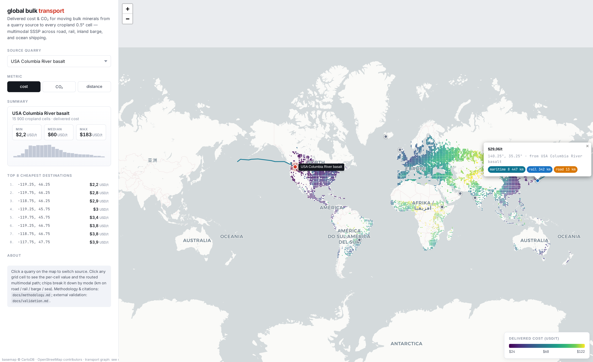
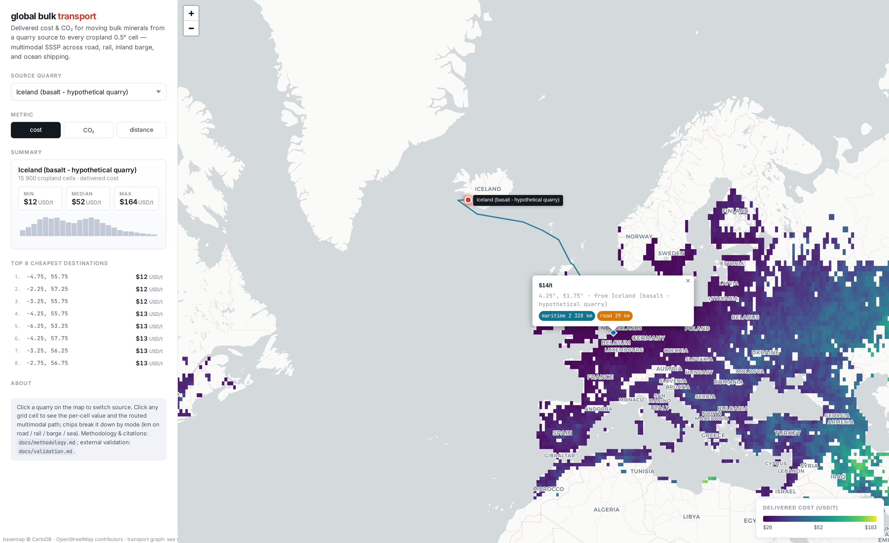
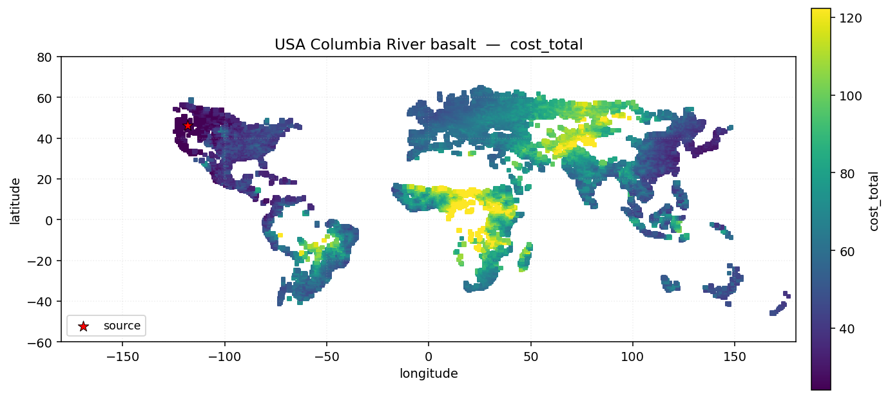

# global-bulk-transport

Global multimodal bulk-transport graph (road + rail + maritime + inland
waterway) with cost (USD) and CO2 (g) attribution per edge, plus
per-source destination-grid routing for Enhanced Rock Weathering (ERW)
research.

This project focusses on **transportation costs and emissions**. It
is also independently usable: take a quarry coordinate, get back a 0.5°
global grid of "cheapest" / "lowest-CO2" / "shortest" delivered cost.

## Quick start

```bash
pixi install
pixi run all                 # full pipeline (downloads inputs, builds graph, routes demo sources)
pixi run viz                 # local web map at http://127.0.0.1:8000
```

For step-by-step incremental builds:

```bash
pixi run -- snakemake -d . -s workflow/Snakefile --cores 4 build_graph
pixi run -- snakemake -d . -s workflow/Snakefile --cores 4 attach_attributes
pixi run -- snakemake -d . -s workflow/Snakefile --cores 4 route
```

Running the underlying Python modules directly is also fine — the
Snakemake rules are thin wrappers. See `workflow/rules/*.smk` for the
exact CLI invocations.

## Demo output

The local viz (`pixi run viz` → http://127.0.0.1:8000):



Pick a source quarry on the map or in the dropdown; toggle metric
(cost / CO₂ / distance); hover any 0.5° cell for its delivered
value. **Click any cell to draw the actual multimodal route** the
SSSP found from source to that destination — colored by mode (orange
road, blue rail, teal sea, cyan barge) with a per-mode km breakdown
in the popup chips. Above: the cost-optimal Columbia River → Gulf-of-
Mexico route surprisingly leaves the continent and rounds Panama by
sea, because that path is cheaper per tonne than the cross-continental
rail/road alternative. Below, and example of a trans-pacific route:



Clicking a destination shows the maritime + short road segments
distinctly:



Static snapshot for use in papers/presentations:



Generate equivalents for any source:

```bash
pixi run figure --source basalt_iceland --metric co2_total
pixi run figure --source dunite_oman    --metric length_km
```

After routing completes, the demo zarr store at `results/routes.zarr/`
contains 8 demo source quarries (Iceland, Deccan, Columbia River, Skye,
Paraná, Oman, NY wollastonite, Ethiopia) routed against ~27 000 0.5°
land cells — replace `config/sources_demo.csv` with your own quarries
and re-run.

### Ad-hoc queries

For an arbitrary lon/lat without rebuilding the zarr store:

```bash
pixi run query -- --lon -118.3 --lat 46.1 --metric cost_total --top 10
pixi run query -- --lon  38.78 --lat  9.03 --metric co2_total --mode road
```

Returns the top-N cheapest destinations from that source as a small
table, using the already-built weighted graph and snapped destinations.

## What's in here

| Path | Purpose |
|------|---------|
| `config/config.yaml`             | Orchestration parameters (paths, snap radii, grid resolution) |
| `config/cost.yaml`               | USD/tkm cost table with full citations |
| `config/co2.yaml`                | g CO2/tkm CO2 table with full citations |
| `config/transshipment.yaml`      | Per-tonne handling cost & CO2 at multimodal interconnects |
| `config/inland_waterways.geojson`| Hand-encoded major inland-bulk-freight systems |
| `docs/methodology.md`            | **Single central document** for methods, assumptions, citations, limitations |
| `docs/validation.md`             | External validation: distance / cost / CO2 cross-checks against published port-pair data, USDA, Drewry, EcoTransIT, IMO 4th GHG |
| `workflow/`                      | Snakemake workflow (per-mode `.smk` rules, mirroring Open-GIRA structure) |
| `tests/`                         | pytest smoke tests (run `pixi run test`) |
| `src/global_bulk_transport/`     | Code |
| `tests/`                         | Smoke tests |

## Design choices and limitations

A complete description lives in `docs/methodology.md` § 8 and a
quantitative external validation is in `docs/validation.md`. In short:

- We do **not** run Open-GIRA on a planet OSM file in this repo (not
  feasible at single-workstation timescales). We mirror Open-GIRA's
  per-mode structure but seed each mode with pre-cleaned global
  datasets: Natural Earth 10m roads + railroads + ports, hand-encoded
  inland waterways (25 systems, ~290 per-segment edges), and a
  hub-and-spoke maritime layer built via `searoute`. The Snakemake
  interface accepts drop-in Open-GIRA outputs with the same edge/node
  schema.
- The cropland mask uses Ramankutty et al. (2008) M3-Cropland 2000 at
  5-arcmin, aggregated to 0.5° (~20 000 cropland cells, 16 000
  road-snappable).
- Cost and CO2 numbers are explicitly 2020–2024 USD reference and per
  the methodology of EcoTransIT (CO2), IMO 4th GHG (sea CO2), USACE
  (barge), and the World Bank LPI 2023 (country adjustments — auto-
  derived for 155 countries; ~20 hand-set yaml overrides take
  precedence where domain knowledge differs).
- External validation (`docs/validation.md`) shows mean absolute error
  ≈ 10.7 % on 11 published port-pair distances, USDA Mississippi grain
  rates bracket our $0.0075/tkm barge cost, and IMO/EcoTransIT CO2
  factors match within ranges. The largest residual errors are on
  Suez-canal-routed corridors where `searoute`'s coarse sea graph
  cuts shortcuts that real shipping avoids.
- Outputs store *terminal* per-(source, dest) values (length / cost /
  CO2), not full paths. Re-routing a single source is fast enough that
  storing paths is not worth the disk.

## License

Released under the MIT License — see [LICENSE](LICENSE).
